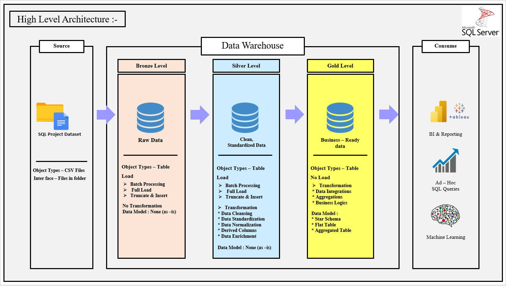
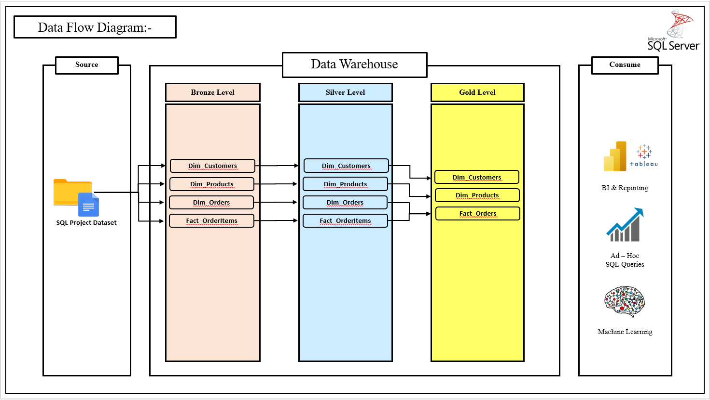
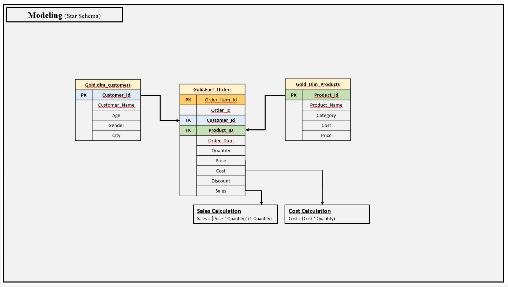
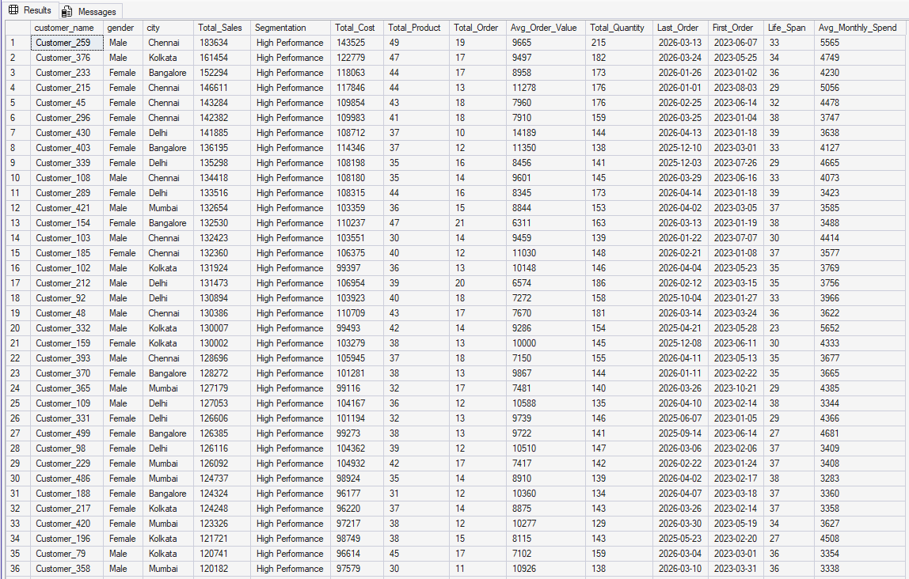
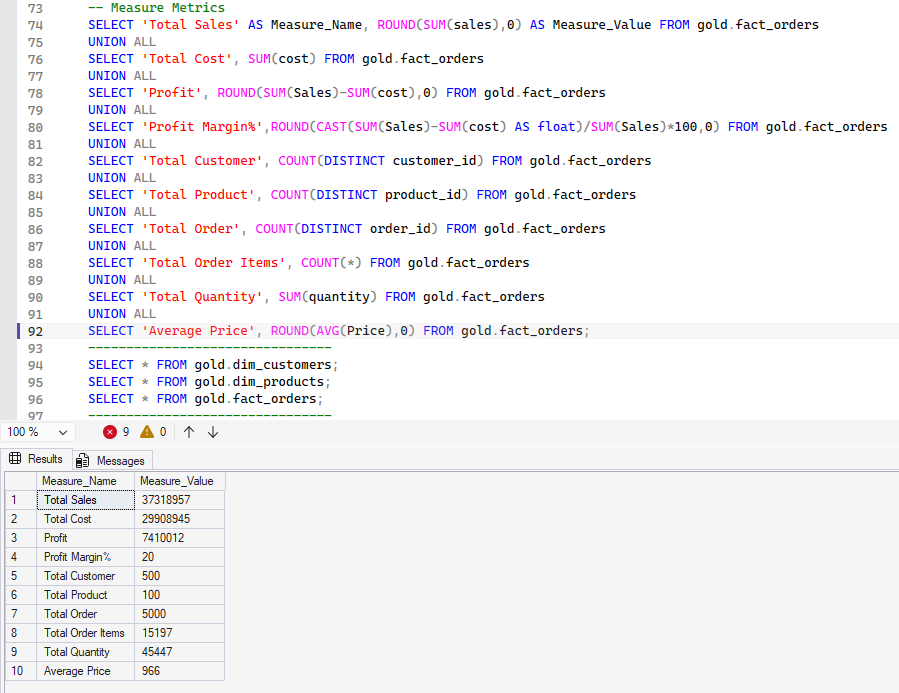
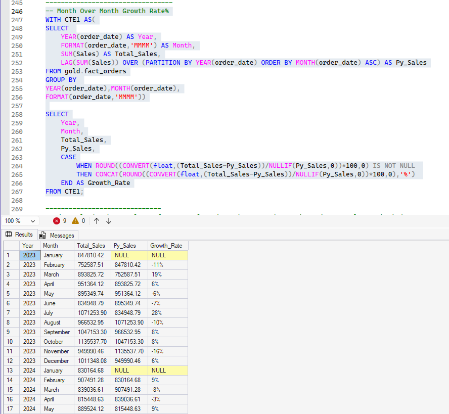
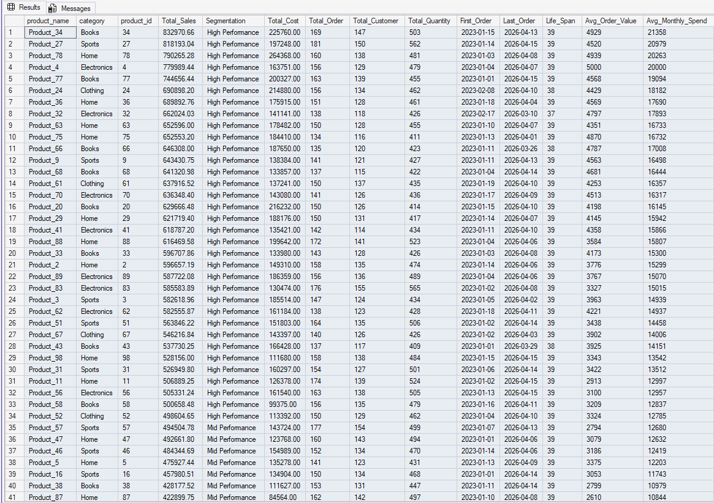
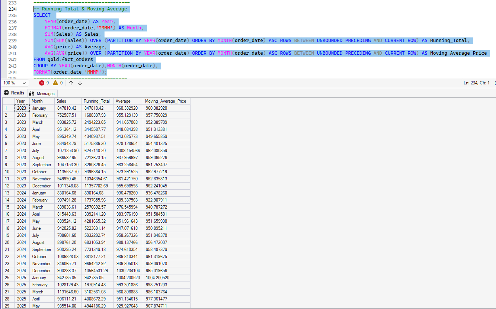

# Retail Sales Data Warehouse & Analytics Project

## Project Overview

This project simulates a retail business intelligence system using SQL-based Medallion Architecture (Bronze, Silver, Gold).

The project demonstrates:
- Data ingestion
- Data cleaning
- Data transformation
- KPI engineering
- Business analytics
- Reporting optimization

---

# Architecture

## Bronze Layer
Stores raw source data.

## Silver Layer
Performs:
- Data cleaning
- Standardization
- Validation

## Gold Layer
Creates:
- Business-ready views
- KPIs
- Analytical reporting tables

---

# Skills Demonstrated

- SQL
- Data Warehousing
- ETL Pipelines
- Data Cleaning
- Window Functions
- CTEs
- KPI Engineering
- Analytical Reporting

---

# Business Questions Solved

1. Which products generate highest revenue?
2. Which customer segments are most profitable?
3. What are monthly sales trends?
4. Which regions perform best?
5. Which products underperform?

---

# SQL Concepts Used

- CTEs
- Window Functions
- DENSE_RANK
- LAG
- CASE Statements
- Aggregations
- Views
- Joins

---

# Project Architecture

---

# Data Flow Diagram

---

# Star Schema Model

---

# Customer Analytics

---

# KPI Metrics Output

---

# Month-over-Month Growth Analysis

---

# Product Performance Analysis

---

# Running Total & Moving Average

